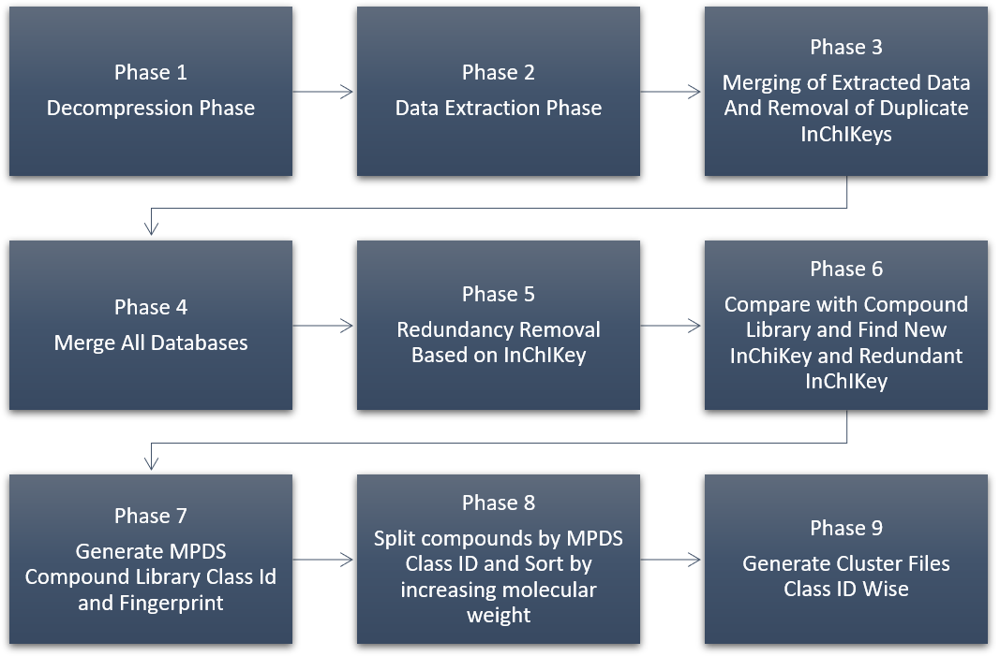
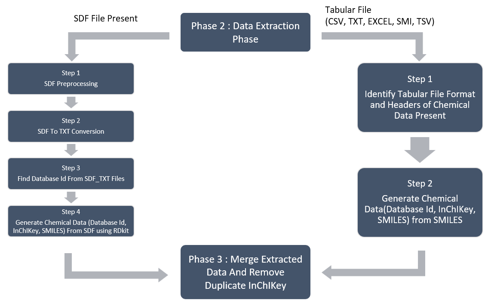

# MPDS Compound Library Pipeline

This pipeline processes chemical databases to generate a curated compound library using cheminformatics library.

---

## 📁 Input Structure

All databases must be placed inside a single directory, with each database in its own folder.

```
Databases_Dir/
├── Database_Dir_1/
│   └── file.sdf
├── Database_Dir_2/
│   └── file.csv
└── Database_Dir_3/
    └── file.zip
```

---

## 📤 Output Structure

### Phase 1–3 Output

```
Extracted_Databases_Dir/
├── Database_Dir_1/
│   ├── rdkit_generated_data_dir/
│   └── final_processed_database_dir/
```

### Final Outputs

* `Merged_Databases.txt`
* `Unique_compounds_Merged_databases.txt`
* `new_inchikey_file.txt`
* `redundant_inchikey_file.txt`
* `MPDS_output.txt`
* `class_wise_sorted_dir/`
* `cluster_wise_dir/`

---

## 🚀 Usage

```python
import os
from mpds_cl_and_pipeline.cl_pipeline_phase_1_to_9 import run_phase_1_to_9

num_workers = max(1, int(os.cpu_count() / 2))

run_phase_1_to_9(
    databases_dir="/path/to/Databases_Dir",
    ref_dir="/path/to/reference_data",
    num_workers=num_workers
)
```

---

## ⚙️ Pipeline Overview

For each database:

1. Decompress files (if needed)
2. Extract chemical data
3. Generate SMILES and InChIKey using RDKit
4. Remove duplicates

After processing all databases:
5. Merge databases
6. Remove redundancy
7. Compare with existing library
8. Generate fingerprints and class IDs
9. Organize and cluster compounds

---

## 🔬 Phase Summary

### Phase 1: Decompression

Extracts `.zip` and `.gz` files.

### Phase 2: Data Extraction

* Supports SDF and tabular formats (CSV, TSV, SMI, Excel)
* Extracts SMILES, InChIKey, and Database IDs

### Phase 3: Deduplication

Removes duplicate compounds within each database.

### Phase 4–5: Merging & Global Deduplication

Combines all databases and removes redundancy.

### Phase 6: Comparison

Identifies new vs existing compounds.

### Phase 7: Feature Generation

Generates:

* MPDS Class ID
* Fingerprint
* Molecular Weight

### Phase 8: Class-wise Sorting

Splits compounds by class and sorts by molecular weight.

### Phase 9: Clustering

Generates cluster-wise compound files.

---

## 📌 Notes

* Ensure consistent column headers within each database
* SDF and tabular files are processed differently
* RDKit is required for chemical processing
